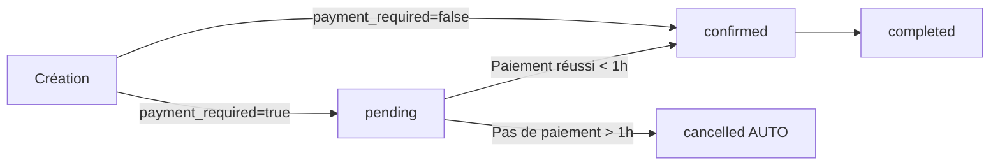

# Règles Métier - Réservations de Rendez-vous

Ce document décrit les règles métier implémentées pour le système de réservation de rendez-vous.

## 1. Validation de l'âge des bénéficiaires selon le module

### Règle
- **Module Enfants** : Réservé exclusivement aux bénéficiaires **mineurs** (< 18 ans)
- **Tous les autres modules** : Réservés exclusivement aux bénéficiaires **majeurs** (≥ 18 ans)

### Implémentation
- **Fichier** : `src/pages/AppointmentBookingPage.tsx`
- **Fonction** : `validateBeneficiariesAge()`
- **Moment** : Validation avant la création du rendez-vous (étape 3)

### Comportement
Si un bénéficiaire ne respecte pas la règle d'âge :
- Un message d'erreur explicite s'affiche
- La réservation est bloquée
- L'utilisateur doit sélectionner un autre bénéficiaire ou un autre module

### Messages d'erreur
```
Module Enfants avec bénéficiaire majeur :
"Le module Enfants est réservé aux bénéficiaires mineurs.
[Prénom Nom] est majeur (25 ans)."

Autre module avec bénéficiaire mineur :
"Ce module nécessite des bénéficiaires majeurs.
[Prénom Nom] est mineur (12 ans).
Veuillez utiliser le module Enfants."
```

## 2. Gestion des services "Sur consultation"

### Règle
Les services avec un prix de **9999 €** (code pour "Nous consulter") ne passent pas par le paiement en ligne mais déclenchent une demande d'information par email.

### Implémentation
- **Fichiers** :
  - `src/pages/AppointmentBookingPage.tsx` (logique frontend)
  - `supabase/functions/send-consultation-request/index.ts` (envoi d'emails)

### Comportement

#### À l'étape de confirmation
1. Une alerte spéciale s'affiche :
   ```
   Service sur consultation
   Ce service nécessite une consultation préalable pour établir
   un devis personnalisé. Veuillez décrire ci-dessous votre situation
   et vos besoins afin que nous puissions vous proposer un tarif adapté.
   ```

2. Le champ "Notes" devient obligatoire :
   - Label : "Contexte de votre demande (obligatoire pour les services sur consultation) *"
   - Validation : Le champ ne peut pas être vide
   - Message d'aide si vide : "Veuillez expliquer le contexte de votre demande..."

#### À la réservation
1. Le rendez-vous est créé avec :
   - Statut : `pending_quote` (en attente de devis)
   - Notes : Le contexte fourni par le client

2. **Email envoyé à l'équipe FL²M** (`contact@fl2m.fr`) :
   ```
   Objet : Demande de consultation - [Nom du service]

   Nouvelle demande de consultation

   Informations du client
   - Nom: [Nom complet]
   - Email: [email@example.com]

   Détails du rendez-vous
   - Service: [Nom du service]
   - Intervenant: [Nom de l'intervenant]
   - Date: [lundi 15 janvier 2025]
   - Heure: [14:00]

   Contexte de la demande
   [Texte fourni par le client]
   ```

3. **Email de confirmation au client** :
   ```
   Objet : Demande de consultation reçue - [Nom du service]

   Votre demande de consultation a bien été reçue

   Notre équipe va étudier votre demande et reviendra vers vous
   dans les plus brefs délais pour vous proposer un tarif adapté
   et confirmer le rendez-vous.
   ```

### Configuration requise
- Variable d'environnement : `RESEND_API_KEY`
- Service d'envoi d'emails : Resend
- Edge Function déployée : `send-consultation-request`

## 3. Expiration des rendez-vous non payés

### Règle
Les rendez-vous nécessitant un paiement mais non payés dans **l'heure suivant leur création** sont automatiquement annulés et le créneau redevient disponible.

### Services concernés
- ✅ Services avec un prix > 0 € (sauf 9999 €)
- ❌ Services gratuits (prix = 0 €)
- ❌ Services "sur consultation" (prix = 9999 €)

### Implémentation
- **Migration SQL** : `supabase/migrations/add_appointment_payment_expiration.sql`
- **Edge Function** : `supabase/functions/cancel-expired-appointments/index.ts`
- **Cron Job** : À configurer (voir `GUIDE_CONFIGURATION_CRON.md`)

### Champs de base de données

#### Table `appointments`
```sql
payment_required    BOOLEAN    -- true si paiement nécessaire
payment_deadline    TIMESTAMPTZ -- Date limite (created_at + 1h)
```

### Processus

#### 1. Création du rendez-vous
```javascript
// Le champ payment_required est défini automatiquement
const price = selectedSlot.custom_price ?? selectedService.price;
const paymentRequired = price > 0 && price !== 9999;

// Le trigger SQL définit automatiquement :
payment_deadline = created_at + INTERVAL '1 hour'
```

#### 2. Redirection vers le paiement
- L'utilisateur est redirigé vers Stripe Checkout
- Temps disponible pour payer : 1 heure
- Une transaction est créée en base avec `status = 'pending'`

#### 3. Cron Job (toutes les 15 minutes)
```sql
-- Fonction SQL appelée automatiquement
SELECT * FROM cancel_expired_unpaid_appointments();
```

Cette fonction :
1. Trouve tous les rendez-vous où :
   - `payment_required = true`
   - `payment_deadline < NOW()`
   - Pas de transaction avec `status = 'paid'`
   - Statut = `pending` ou `confirmed`

2. Pour chaque rendez-vous trouvé :
   - Change le statut à `cancelled`
   - Ajoute une note : "Annulé automatiquement : paiement non reçu dans les délais (1 heure)"
   - Supprime les liaisons avec les bénéficiaires
   - Le créneau redevient disponible

3. Envoie une notification au client (optionnel)

### États des rendez-vous



### Cas particuliers

#### Paiement après annulation
- Le rendez-vous reste annulé
- Le créneau est redevenu disponible
- L'utilisateur doit faire une nouvelle réservation
- Stripe ne facture pas (session expirée)

#### Service gratuit
- Pas de `payment_deadline`
- Confirmé immédiatement
- Jamais annulé automatiquement

#### Service "sur consultation"
- Pas de `payment_deadline`
- Statut : `pending_quote`
- Annulation manuelle uniquement

## Configuration et déploiement

### Pour la validation d'âge
✅ Déjà actif (frontend uniquement)

### Pour les emails de consultation
1. Configurer Resend API Key :
   ```bash
   npx supabase secrets set RESEND_API_KEY=re_xxxxx
   ```

2. Déployer la fonction :
   ```bash
   npx supabase functions deploy send-consultation-request
   ```

### Pour l'expiration automatique
1. Appliquer la migration SQL
2. Déployer la Edge Function
3. Configurer le cron job

Voir le guide complet : `GUIDE_CONFIGURATION_CRON.md`

## Tests

### Test 1 : Validation d'âge
1. Créer un bénéficiaire mineur (< 18 ans)
2. Réserver un service "Adultes"
3. ✓ Vérifier le message d'erreur

### Test 2 : Service "sur consultation"
1. Créer un service avec prix = 9999
2. Réserver ce service
3. ✓ Vérifier l'alerte "Service sur consultation"
4. ✓ Vérifier que le champ contexte est obligatoire
5. ✓ Vérifier la réception des emails

### Test 3 : Expiration des paiements
1. Créer un service payant (ex: 50 €)
2. Réserver sans payer
3. Attendre 1 heure
4. Exécuter manuellement : `SELECT * FROM cancel_expired_unpaid_appointments();`
5. ✓ Vérifier que le rendez-vous est annulé
6. ✓ Vérifier que le créneau est redevenu disponible

## Support

Pour toute question ou problème, consulter :
- `GUIDE_CONFIGURATION_CRON.md` pour les détails techniques
- Logs Supabase : Dashboard > Functions > Logs
- Base de données : Table `appointments` et `transactions`
