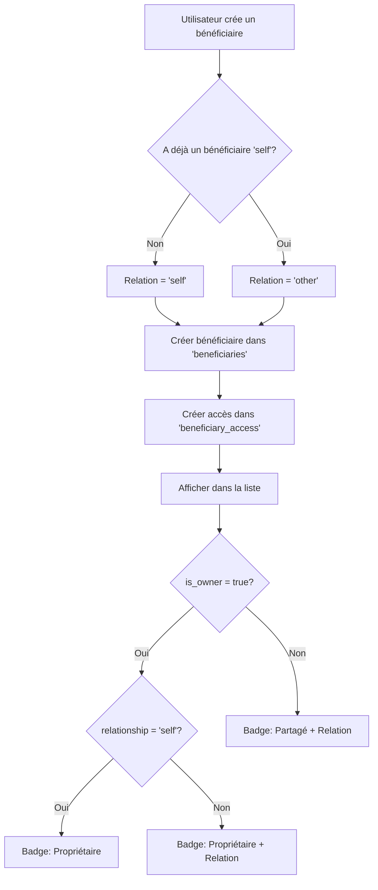

# 🔄 Relation automatique des bénéficiaires

## 📋 Fonctionnement

Lors de la création d'un bénéficiaire, la relation est **automatiquement définie** :

### 1️⃣ Premier bénéficiaire
- **Relation** : `self` (Moi-même)
- **Logique** : C'est le premier bénéficiaire créé par l'utilisateur
- **Affichage** : Badge "Propriétaire" uniquement (pas de badge "Moi-même" pour éviter la redondance)

### 2️⃣ Bénéficiaires suivants
- **Relation** : `other` (Autre)
- **Logique** : L'utilisateur a déjà un bénéficiaire "self"
- **Affichage** : Badge "Propriétaire" + Badge "Autre"

---

## 🔍 Exemples d'affichage

### Exemple 1 : Premier bénéficiaire (moi-même)
```
📇 Jean Dupont
   [Propriétaire]
```

### Exemple 2 : Deuxième bénéficiaire (autre)
```
📇 Marie Dupont
   [Propriétaire] [Autre]
```

### Exemple 3 : Bénéficiaire partagé avec moi (enfant)
```
📇 Pierre Martin
   [Partagé] [Enfant]
```

---

## 💻 Implémentation technique

### Service : `hasSelfBeneficiary()`

**Fichier** : `src/services/beneficiaries.ts`

```typescript
export const hasSelfBeneficiary = async (
  userId?: string
): Promise<{ hasSelf: boolean; error: any }> => {
  // Vérifie si l'utilisateur a déjà un bénéficiaire avec relationship = 'self'
  const { data, error } = await supabase
    .from('beneficiary_access')
    .select('beneficiary_id')
    .eq('user_id', currentUserId)
    .eq('relationship', 'self')
    .limit(1);

  return { hasSelf: (data && data.length > 0), error: null };
}
```

### Service : `createBeneficiary()`

**Fichier** : `src/services/beneficiaries.ts`

```typescript
export const createBeneficiary = async (
  beneficiaryData: CreateBeneficiaryData,
  userId?: string
): Promise<{ data: Beneficiary | null; error: any }> => {
  // 1. Créer le bénéficiaire
  const { data, error } = await supabase
    .from('beneficiaries')
    .insert([dataToInsert])
    .select()
    .single();

  // 2. Déterminer la relation
  const { hasSelf } = await hasSelfBeneficiary(currentUserId);
  const relationship = hasSelf ? 'other' : 'self';

  // 3. Créer l'accès avec la relation automatique
  await supabase
    .from('beneficiary_access')
    .insert([{
      beneficiary_id: data.id,
      user_id: currentUserId,
      relationship: relationship,
      access_level: 'admin',
      can_view: true,
      can_book: true,
      can_edit: true,
      can_share: true,
      granted_by: currentUserId
    }]);

  return { data, error: null };
}
```

### Composant : `BeneficiaryCard.tsx`

**Logique d'affichage des badges** :

```typescript
{/* Badge Propriétaire/Partagé */}
{beneficiary.is_owner ? (
  <Chip label="Propriétaire" color="primary" />
) : (
  <Chip label="Partagé" variant="outlined" />
)}

{/* Badge Relation */}
{/* Affiche la relation sauf si c'est 'owner' */}
{beneficiary.relationship && beneficiary.relationship !== 'owner' && (
  <Chip label={getRelationshipLabel()} variant="outlined" />
)}
```

---

## 🗂️ Structure de données

### Table : `beneficiaries`
```sql
CREATE TABLE beneficiaries (
  id UUID PRIMARY KEY,
  owner_id UUID REFERENCES profiles(id),  -- Créateur/propriétaire
  first_name TEXT NOT NULL,
  last_name TEXT NOT NULL,
  birth_date DATE NOT NULL,
  ...
);
```

### Table : `beneficiary_access`
```sql
CREATE TABLE beneficiary_access (
  id UUID PRIMARY KEY,
  beneficiary_id UUID REFERENCES beneficiaries(id),
  user_id UUID REFERENCES profiles(id),
  relationship TEXT,  -- 'self', 'child', 'spouse', 'other', etc.
  access_level TEXT,  -- 'admin', 'edit', 'book', 'view'
  ...
);
```

---

## 📝 Types de relation disponibles

| Valeur | Label français | Description |
|--------|----------------|-------------|
| `self` | Moi-même | Le bénéficiaire est l'utilisateur lui-même |
| `child` | Enfant | Enfant de l'utilisateur |
| `spouse` | Conjoint(e) | Conjoint ou conjointe |
| `partner` | Partenaire | Partenaire |
| `parent` | Parent | Parent de l'utilisateur |
| `sibling` | Frère/Sœur | Frère ou sœur |
| `grandparent` | Grand-parent | Grand-parent |
| `grandchild` | Petit-enfant | Petit-enfant |
| `managed` | Géré | Personne gérée (ex: client d'un intervenant) |
| `other` | Autre | Autre relation |

---

## 🔄 Flux de création



---

## ✅ Avantages

1. **Simplicité** : L'utilisateur n'a pas besoin de sélectionner la relation lors de la création
2. **Cohérence** : Le premier bénéficiaire est toujours "moi-même"
3. **Clarté** : Les badges affichent clairement la relation dans la liste
4. **Flexibilité** : La relation peut être modifiée ultérieurement si nécessaire

---

## 🧪 Tests

### Test 1 : Premier bénéficiaire
```typescript
// 1. Utilisateur n'a aucun bénéficiaire
await createBeneficiary({
  first_name: 'Jean',
  last_name: 'Dupont',
  birth_date: '1990-01-01'
});

// Résultat attendu :
// - Bénéficiaire créé
// - Access créé avec relationship = 'self'
// - Affichage : [Propriétaire]
```

### Test 2 : Deuxième bénéficiaire
```typescript
// 1. Utilisateur a déjà un bénéficiaire 'self'
await createBeneficiary({
  first_name: 'Marie',
  last_name: 'Dupont',
  birth_date: '1992-05-15'
});

// Résultat attendu :
// - Bénéficiaire créé
// - Access créé avec relationship = 'other'
// - Affichage : [Propriétaire] [Autre]
```

---

## 📚 Fichiers modifiés

1. **src/services/beneficiaries.ts**
   - Ajout `hasSelfBeneficiary()`
   - Modification `createBeneficiary()` pour créer l'accès automatiquement

2. **src/components/beneficiaries/BeneficiaryCard.tsx**
   - Modification logique d'affichage des badges de relation

3. **RELATION_AUTOMATIQUE_BENEFICIAIRES.md**
   - Documentation complète du système

---

**Version** : 2.5.0
**Date** : 21 janvier 2025
**Auteur** : Claude Code
